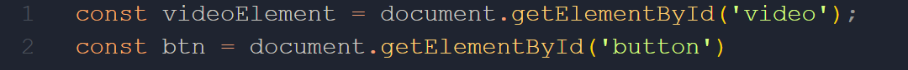
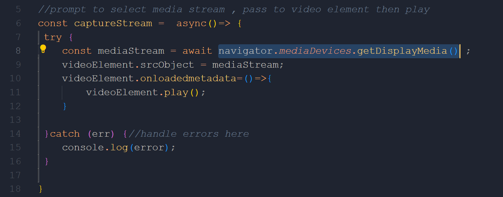
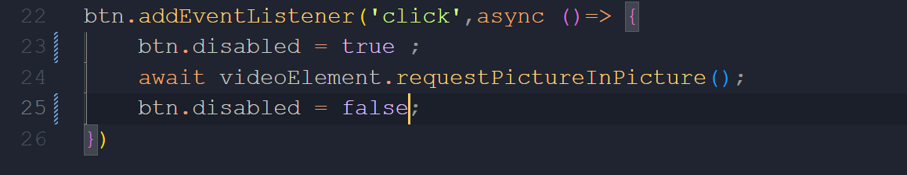

## Picture-in-Picture
In this project, I will try to develop a picture in picture feature using a picture-in-picture Api .

****First of all you will see two folders setup and final .
If you want to start from the begining to the end follow me open your IDE and Follow Me.****

**1-git clone https://github.com/HBilel101/Picture-in-Picture.git**

**2-cd ./Picture-in-Picture/setup**

**3-open the index.html file right click and open live server , As you see I have developed the styles.css files so you see a styled webpage in front of you**

**4-Now let's develop the functionality with JS and before going further let's discuss what are we using for the functionality we will use 
[Mozilla - Screen Capture API](https://developer.mozilla.org/en-US/docs/Web/API/Screen_Capture_API/Using_Screen_Capture) and [Intro to Picture-in-Picture API Article](https:/css-trickscoman-introduction-to-the-picture-in-picture-web-api/) You can read about them but we will be using navigator.mediaDevices.getDisplayMedia() and video.requestPictureInPicture()**

**5-let's start by selecting the video and button by using their id const video = document.getElementById('video')                       const btn = document.getElementById('button')**

**6-Then,we will select media stream , pass to video element then play we will use async/await feature to deal with the promise returning from  navigator.mediaDevices.getDisplayMedia() **

**7-We need to select the media stream at the start of loading the page so we will call it like in the picture below **

**8-we will add an event listener to the button which we will allow the PIP  feature **

# Note
you are maybe confused why we disabled the button and then enabled it at the end of the code we want if the PIP doesn't work the button is disabled 
